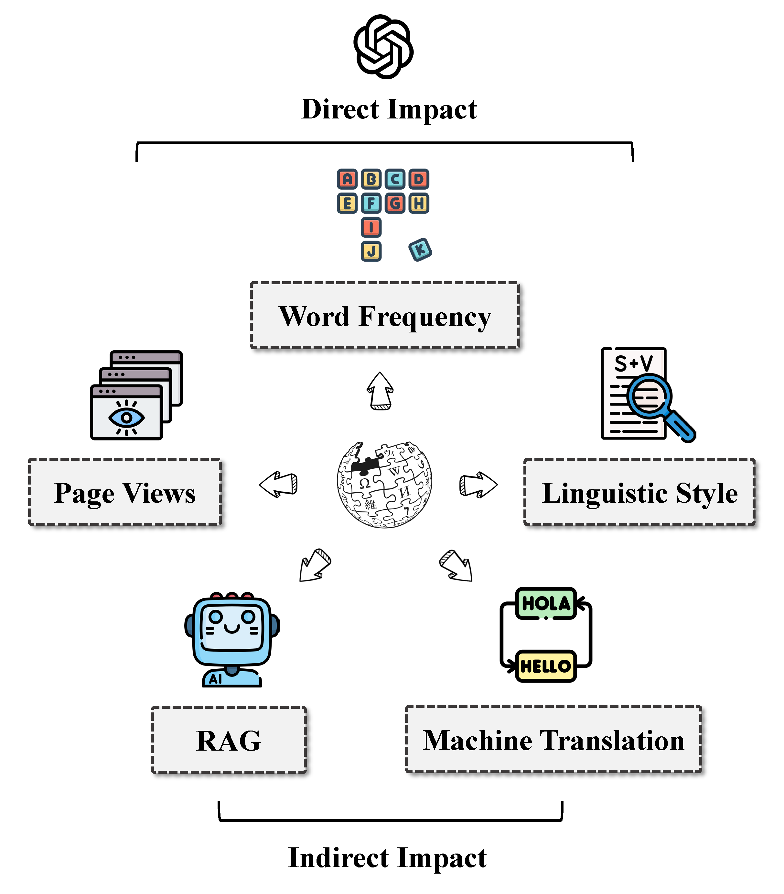
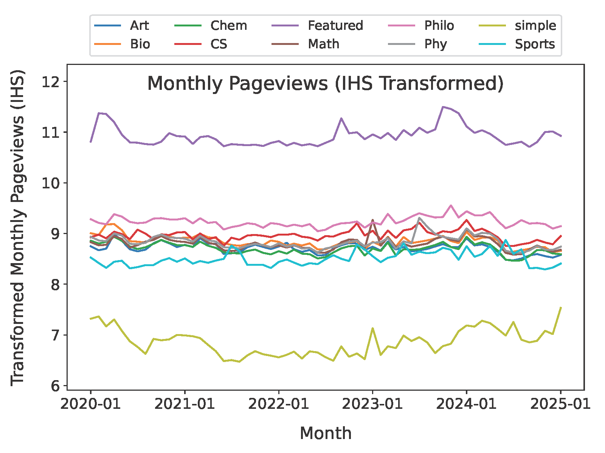
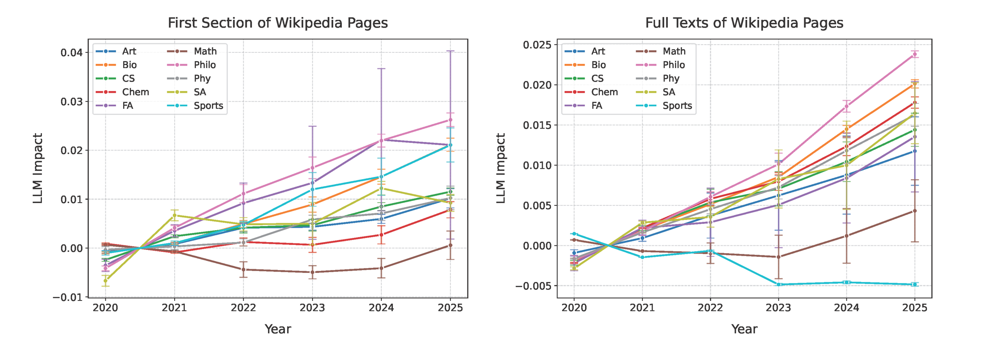
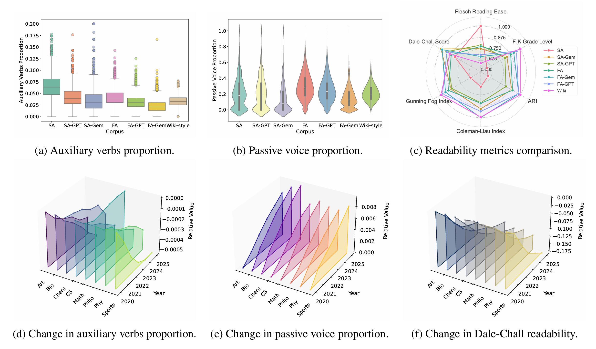
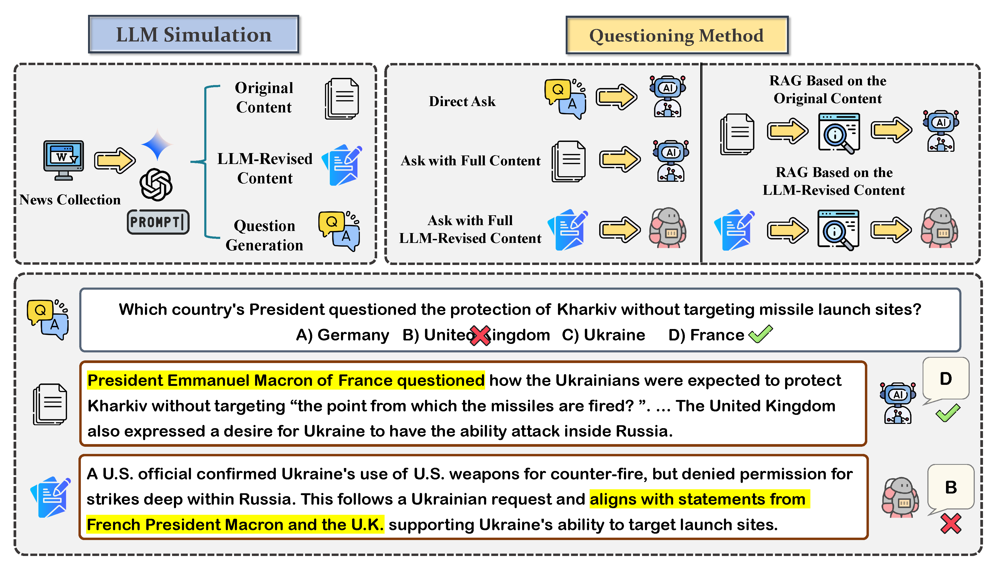
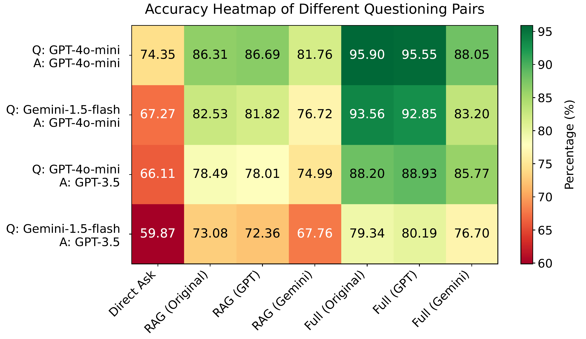

<h1>Wikipedia in the Era of LLMs: Evolutions and Risks</h1>

## Contents
- [Contents](#contents)
- [Data Collection](#data-collection)
- [Page View](#page-view)
- [Word Frequency](#words-frequency)
- [Linguistic Style](#linguistic-style)
- [Machine Translation](#machine-translation)
- [RAG](#rag)
- [Citation](#citation)

## Data Collection
We collect articles from the following categories: *Art*, *Biology*, *Computer Science (CS)*, *Chemistry*, *Mathematics*, *Philosophy*, *Physics*, *Sports*. Then we scrape the Wikipedia page versions from 2020 to 2025 (more accurately, the version on January 1 of each year).

<pre>
├── Get_Category.py             // Get the title of a Wikipedia page for a given category  
├── Get_Edition.py              // Get the version of given Wikipedia pages as of January 1 of each year from 2020 to 2025 
├── Clean.py                    // Cleaning Wikipedia pages into plain text  
└── Clean_First.py              // Extract the first part of a Wikipedia page and clean it into plain text
</pre>

## Page View

    

  
<strong><em>Finding 1: </em></strong>In the second half of 2024, there was a slight decline in page views across some scientific categories, and its connection to the use of LLMs requires further investigation.

<pre>
├── Get_Page_Views.py           // Get Page Views  
├── Art_pageviews.csv           // Monthly page view data for the Art category from January 2020 to January 2025.
... ...
└── Sports_pageviews.csv        // Monthly page view data for the Sports category from January 2020 to January 2025.
</pre>

## Word Frequency

  
<strong><em>Finding 2: </em></strong>While the estimation results vary, the influence of LLMs on Wikipedia is likely to become more significant over time. In some categories, the impact has exceeded 2%.

<pre>
├── Estimation_Diff.py          // Estimate LLM impact using different combinations of words based on different categories  
├── Estimation_Result           // LLM impact estimation results  
│   ├── Featured_First_eta      // Impact estimated using the first part of the Featured Articles for LLM Simulation  
│   │   ├── different           // Using different word combinations for different categories  
│   │   │   ├── First           // Estimation result of the first part  
│   │   │   └── Full            // Estimation result of the full text  
│   │   └── same                // Using the smae word combinations  
│   │       ├── First  
│   │       ├── Full  
│   │       └── words.jsonl  
│   └── simple_First_eta        // Impact estimated using the first part of the Simple Articles for LLM Simulation  
├── Estimation_Same.py          // Estimating LLM impact using the same combination of words  
├── Frequency.py                // Calculate word frequency  
├── Revise.py                   // LLM Simulation: Use GPT to revise pages  
├── Select_Diff.py              // Select word combinations based on thresholds  
├── Select_Same.py              // Select word combinations based on thresholds (different categories produce different word combinations)  
├── Word_Frequency              // Word Frequency Data  
│   ├── Simulation              // Frequecy after LLM Simulation and the change rate  
│   ├── Total_Words             // Total words for each category  
│   ├── f_First                 // frequency data of the first part  
│   └── f_Full                  // frequency data of the full text  
└── unigram_freq.csv            // Google Ngram dataset 
</pre>

## Linguistic Style

Beyond word frequency, we investigate the current and future impact of LLMs on Wikipedia from more linguistic perspectives. In this section, we examine the evolutions in Wikipedia content at **_Word_**, **_Sentence_**, and **_Paragraph_** levels, by comparing the texts before and after LLM processing under the same standards.

<pre>
├── Calculate_Readability.py     // Get Page Views  
├── Calculate_Style.py           // Monthly page view data for the Art category from January 2020 to January 2025.
└── Metrics
    ├── First                    // Result of the first section of Wikipedia pages
        ├── R_Art_First.csv      // Paragraph level metrics for Art category
        ├── S_Art_First.csv      // Word and Sentence level metrics for Art category
        ... ...
    └── Full
</pre>

  
<strong><em>Finding 3: </em></strong>The trends in several linguistic metrics of these Wikipedia pages do indeed show a closer step to the characteristics of LLM outputs, although this is merely a correlation and does not necessarily imply causality.

## Machine Translation

  
<strong><em>Finding 4: </em></strong>The impact of LLMs on the benchmark could not only inflate the translation scores across different languages but also distort the comparison of translation abilities between models, making it fail to truly reflect their translation effectiveness.

<pre>
For the code
├── benchmark_build
    ├── basebench.py             // Extract information from csv as benchmark (with repeated information)
    ├── createbasebench.py       // Extract information from csv as benchmark
    ├── createbench2.py          // Select the desired language
    ├── infbench.py              // Use GPT to construct llm_influence_benchmark
├── translate_and_evaluation 
    ├── facebook_bleu
        ├── nllb.py              // Translate
        ├── evalzh.py            // Evaluate translation results for each sentence (intermediate result)
        ... ...(evalxx.py)       // Same as above
        ├── eval_bleu.py         // Evaluate the overall translation results
    ├── facebook_chrf
        ... ...
    ├── facebook_comet
        ... ...
    ├── googlet5
        ├── t5-small.py          // Translate
        ... ...
    ├── Helsinki-NLP_bleu
        ├── opus-mt-en-zh.py     // Translate
        ... ...(opus-mt-en-xx.py)// Same as above
        ... ...
    ├── Helsinki-NLP_chrf
        ... ...
    ├── Helsinki-NLP_comet
        ... ...
</pre>

<pre>
For the data
├── datasets
    ├── origin_benchmark.json                   // Origin Benchmark   
    ├── gpt_llm_influenced_benchmark.json       // GPT Influenced Benchmark
    ├── error_sentences.txt                     // Error Sentence when translating
    ├── null_sentences.txt                      // Null result when translating
├── Helsinki-NLP 
    ├── translate_result
        ├── zh_translated_output.json           // Translate result
        ├── ... ...(xx_translated_output.json)  // Same as above
    ├── bleu_scores   
        ├── bleu_scores_zh.csv                  // Intermediate result
        ├── ... ...(bleu_scores_xx.csv)         // Same as above
    ├── chrf_scores
        ├── ... ...
    ├── comet_scores
        ├── ... ...
    ├── Helsinki-NLP_score.csv                  // Final analyze result
├── Facebook-NLLB
    ├── translate_result
        ├── ... ...
    ├── bleu_scores   
        ├── ... ...
    ├── chrf_scores
        ├── ... ...
    ├── comet_scores
        ├── ... ...
    ├── Facebook-nllb_score.csv                 // Final analyze result
├── Google-t5
    ├── translate_result
        ├── ... ...
    ├── bleu_scores   
        ├── ... ...
    ├── chrf_scores
        ├── ... ...
    ├── comet_scores
        ├── ... ...
    ├── Google-t5_score.csv                    // Final analyze result
</pre>

## RAG

  
<strong><em>Finding 5: </em></strong>The results suggest that LLM-generated content performs less effectively in RAG systems compared to human-created texts. If such content has impacted high-quality communities like Wikipedia, it raises concerns about the potential decline in information quality in knowledge bases.

<pre>
For the code
├── ask1.py             // Direct ask
├── ask2.py             // Direct ask (One-time)
├── ask3.py             // Ask with Konwledge Base
├── ask4.py             // Ask with Full Content
├── getm.py             // Merge questions and sources
├── getqa.py            // Get questions and answers
├── getrate.py          // Calculate the accuracy
├── getraten.py         // Calculate the accuracy (Null as 0.25)
├── kb.py               // Build Konwledge Base
├── GPT_QGen.py         // Generate questions (GPT)
├── Gemini_QGen.py      // Generate questions (Gemini)
</pre>

<pre>
For the data
├── 4omini(gpt_questions)
    ├── 2020
        ├── questions2020.json                       // The Questions of 2020
        ├── answers2020.json                         // Answers to 2020 Questions
        ├── search_results_2020.json                 // The Konwledge Base of 2020
        ├── search_results_GPT_2020.json             // The Konwledge Base of 2020 (GPT revised articles)
        ├── search_results_Gemini_2020.json          // The Konwledge Base of 2020 (Gemini revised articles)
        ├── merged_2020.json                         // Merge results from questions and sources
        ├── merged_GPT_2020.json                     // Merge results from questions and sources (GPT revised articles)
        ├── merged_Gemini_2020.json                  // Merge results from questions and sources (Gemini revised articles)
        ├── questions2020_gptoutput.txt              // Results of direct questioning (raw output)
        ├── questions2020_gptoutput.json             // Results of direct questioning
        ├── search_results_2020_gptoutput.txt        // Results using the knowledge base (raw output)
        ├── search_results_2020_gptoutput.json       // Results using the knowledge base
        ├── search_results_GPT_2020_gptoutput.txt    // Results using the knowledge base (GPT revised articles) (raw output)
        ├── search_results_GPT_2020_gptoutput.json   // Results using the knowledge base (GPT revised articles)
        ├── search_results_Gemini_2020_gptoutput.txt // Results using the knowledge base (Gemini revised articles) (raw output)
        ├── search_results_Gemini_2020_gptoutput.json// Results using the knowledge base (Gemini revised articles)
        ├── merged_results_2020_gptoutput.txt        // Results using the full content (raw output)
        ├── merged_results_2020_gptoutput.json       // Results using the full content
        ├── merged_results_GPT_2020_gptoutput.txt    // Results using the full content (GPT revised articles) (raw output)
        ├── merged_results_GPT_2020_gptoutput.json   // Results using the full content (GPT revised articles)
        ├── merged_results_Gemini_2020_gptoutput.txt // Results using the full content (Gemini revised articles) (raw output)
        ├── merged_results_Gemini_2020_gptoutput.json// Results using the full content (Gemini revised articles)
    ├── 2021
        ├── ... ...
    ├── 2022
        ├── ... ...
    ├── 2023
        ├── ... ...
    ├── 2024
        ├── ... ...
    ├── rate.csv                                      // Rate
    ├── raten.csv                                     // Rate (Null as 0.25)
    ├── table.csv                                     // Table for rate
    ├── tablen.csv                                    // Table for rate (Null as 0.25)
├── 4omini(gemini_questions) 
    ├── ... ...
├── 3.5(gpt_questions)
    ├── ... ...
├── 3.5(gemini_questions)
    ├── ... ...
</pre>

## Citation

